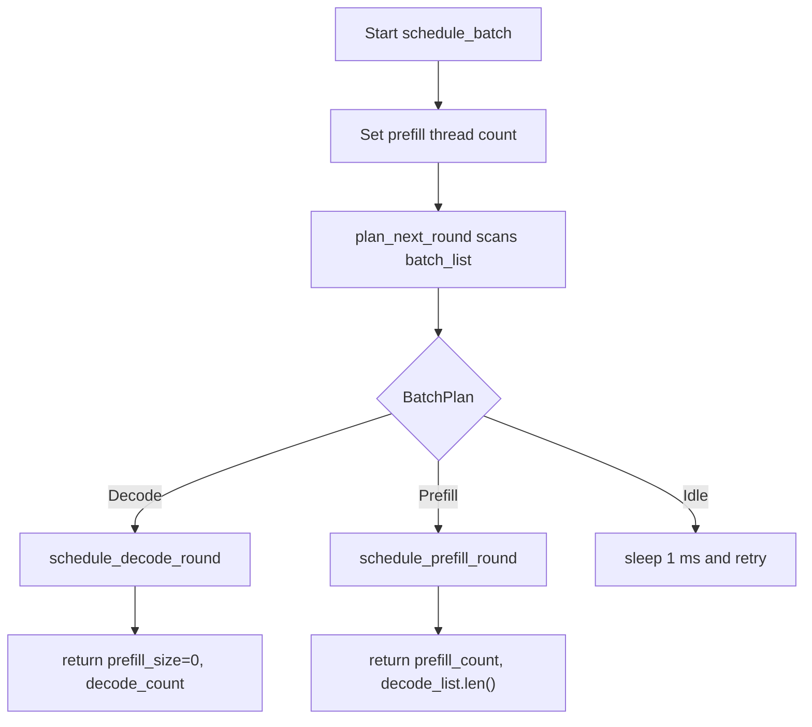
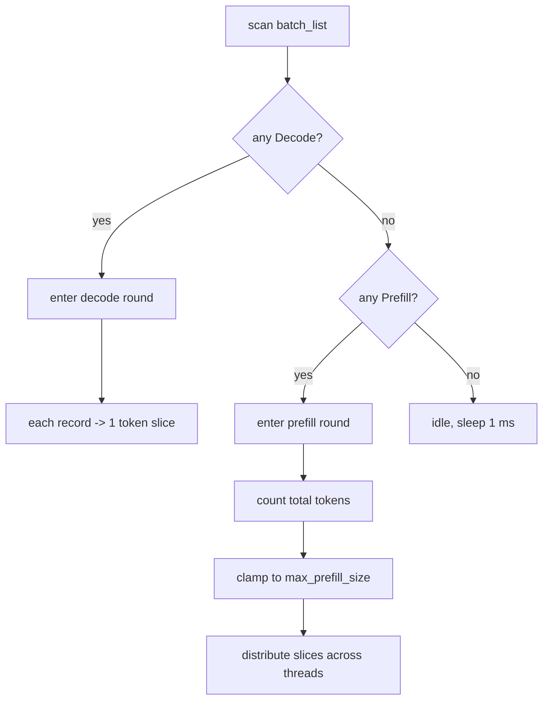

# Inference Scheduler Overview

---

This document explains the actual behavior of `src/runtime/scheduler.rs` and `src/runtime/slice_scheduler.rs`.

The short version:

* `BatchScheduler` decides whether the current round is `Decode`, `Prefill`, or `Idle`
* It uses an internal `BatchPlan` enum to separate planning from execution
* It only produces slices and does not advance `SequenceState` directly
* A `Prefill` round splits tokens across threads using static quotas
* A `Decode` round compresses each sequence into a single length-1 slice
* `decode_list` is the shared attention/decode slice set for the current round

---

## 1. Related Objects

### `SequenceState`

When the scheduler scans `batch_list`, it mainly looks at these fields:

| Field | Role |
| --- | --- |
| `phase` | Decides whether the slot currently belongs to decode or prefill |
| `sequence_index` | Prefill start position |
| `kv_index` | The sequence position used as the next token location during decode |
| `filling_length` | How many prefill tokens remain |

### `SequenceSlice`

The smallest work unit produced by the scheduler.

| Field | Role |
| --- | --- |
| `batch_index` | Corresponding batch slot |
| `sequence_index` | Slice start position within the sequence |
| `token_start_index` | Start position in the flattened token view for this round |
| `length` | Length of the continuous token segment |
| `last_token_flag` | Whether this is the prompt's last token; if so, it should continue through the decode / output-write path |

### Output Lists

Each round returns two kinds of results:

* `prefill_list: Vec<Vec<SequenceSlice>>`
* `decode_list: DecodeList`

Where:

* `prefill_list` is bucketed by thread
* `decode_list` is a flattened attention/decode slice list

---

## 2. `BatchPlan`

`BatchPlan` is an internal planning result used by `BatchScheduler`.

It represents the next round before the scheduler actually writes slices:

* `Decode(Vec<(usize, usize)>)`
* `Prefill { candidates, total_tokens }`
* `Idle`

This keeps the decision logic separate from slice construction:

* `plan_next_round()` scans `batch_list` and chooses one plan
* `schedule_batch()` executes that plan and fills `prefill_list` / `decode_list`

The priority is:

* If any `Decode` exists, the round becomes `Decode`
* Otherwise, if any `Prefill` exists, the round becomes `Prefill`
* Otherwise the scheduler is `Idle`

---

## 3. Single-Round Scheduling Entry

The flow of `schedule_batch()` can be summarized as:



The flow of `schedule_batch()` can be summarized as:

```text
1. Set the prefill thread count
2. Scan batch_list
3. If Decode exists -> enter decode round
4. Else if Prefill exists -> enter prefill round
5. Else sleep 1 ms and retry
```

The key rules are:

* `Decode` has priority over `Prefill`
* One round only executes one mode
* Even in a `Prefill` round, `decode_list` is still produced, because the last-token path is consumed by the attention/decode side of the pipeline

---

## 4. Decode Round

### Candidate Collection

The scheduler filters all `Phase::Decode` records out of `batch_list`.

At most the first `max_decode_size` candidates are taken, where:

```text
max_decode_size = batch_size
```

### Slice Generation

Each decode candidate produces a `SequenceSlice` of length `1`:

* `sequence_index` is taken directly from `record.kv_index`
* `last_token_flag = true`
* `token_start_index` increases in the order of appearance

So the decode round is very simple:

* One sequence contributes only 1 token in this round
* `decode_list` is the attention/decode slice set for this round
* `prefill_list` is cleared

---

## 5. Prefill Round

### Candidate Collection

For each `Phase::Prefill` record, the scheduler reads:

* `batch_index`
* `sequence_index`
* `filling_length`

It then accumulates `filling_length` into the potential total token count for the round.

### Round Limit

The total number of prefill tokens is not unbounded; it is constrained by the window:

```text
max_prefill_size = sequence_length * batch_size
total_tokens = min(sum(filling_length), max_prefill_size)
```

This means:

* If the total demand fits within the window, the scheduler tries to schedule everything
* If the total demand exceeds the window, only the portion allowed by the window is scheduled

### Slice Generation

The prefill round generates two views at the same time:

* A flattened continuous range in `decode_list`
* Thread-bucketed slices in `prefill_list`

`SliceScheduler::schedule_for_sequence()` splits a sequence into multiple slices according to the current task quota and pushes them into the corresponding thread bucket.

### Thread Quota

`FairTaskAllocator` uses the following balancing rule:

```text
base_quota  = total_tokens / task_count
extra_quota = total_tokens % task_count
```

So:

* The first `extra_quota` threads get `base_quota + 1`
* The remaining threads get `base_quota`

If there are fewer tokens than threads, only a few threads are activated.

---

## 6. What `decode_list` Really Means

`decode_list` is not a list "for decode only".

It carries the flattened attention/decode token view in both modes:

* Decode round: each slice has fixed length `1`
* Prefill round: each slice represents a continuous attention range

That is why later operators such as `Attention`, `LiftVector`, and `TopKSoftmax` can consume it uniformly.

---

## 7. State Update Boundary

`BatchScheduler` itself does not modify `SequenceState`.

From the current code, state advancement happens in the operator stage, especially in `TopKSoftmax`:

* If a slice comes from `Prefill`, it first advances `sequence_index`, `kv_index`, and `filling_length`
* When `filling_length == 0`, the phase switches to `Decode`
* `last_token_flag` only marks whether the slice contains the prompt's last token
* When the slice is the last token and the record is already in `Decode`, the output token is actually written back
* If the output token hits `eos_id`, the phase switches to `Eos` and the upper layer is notified

So the scheduler and the state machine are separate:

* The scheduler decides "what should run this round"
* The operator decides "how the state changes after it runs"

---

## 8. Typical Execution Path



```text
scan batch_list
    if any Decode:
        enter decode round
        each record -> 1 token slice
    else if any Prefill:
        enter prefill round
        count total tokens
        clamp to the window limit
        distribute slices evenly across threads
    else:
        idle, sleep 1 ms
```

---

## 9. Code Entry References

* `src/runtime/scheduler.rs`
* `src/runtime/slice_scheduler.rs`
* `src/operators/softmax/topk_softmax.rs`
* `src/runtime/runner.rs`
