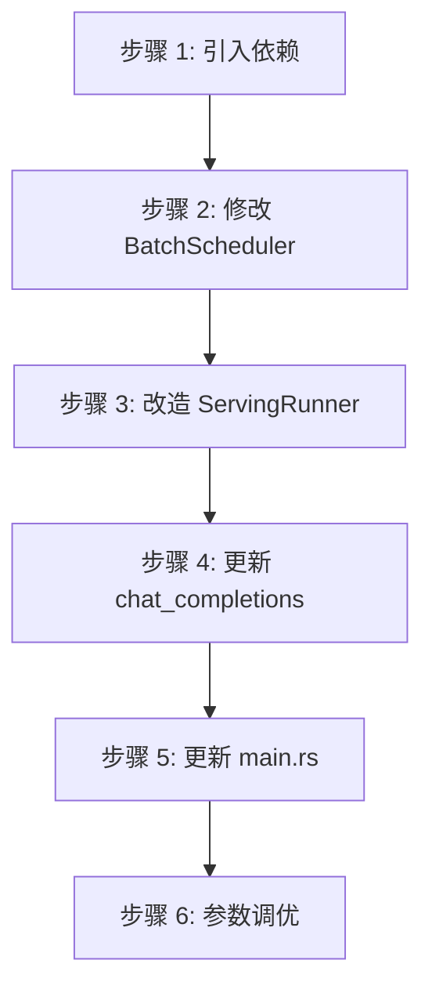

# 调度优化配置指南

---

## 目录

1. [可调参数](#1-可调参数)
2. [调优策略](#2-调优策略)
3. [迁移路径](#3-迁移路径)
4. [代码结构](#4-代码结构)

---

## 1. 可调参数

所有参数均通过环境变量配置，在 `ServingConfig::new()` 中读取，值为 0 时回退到默认值。

| 参数 | 环境变量 | 默认值 | 建议范围 | 说明 |
|------|----------|--------|----------|------|
| `batch_size` | `ELLM_BATCH_SIZE` | 3 | 1-32 | 最大并发请求数（batch 槽位数） |
| `sequence_length` | `ELLM_SEQUENCE_LENGTH` | 128 | 64-4096 | 每个槽位的最大 token 序列长度 |
| `chunk_size` | `ELLM_CHUNK_SIZE` | 64 | 32-1024 | Prefill 每轮最大 token 数，同时作为 `token_threshold` |
| `schedule_timeout_ms` | `ELLM_SCHEDULE_TIMEOUT_MS` | 10 | 5-50 | 超时触发调度的时间窗口（毫秒） |

---

## 2. 调优策略

| 场景 | 策略 |
|------|------|
| **低延迟** | 降低 `ELLM_CHUNK_SIZE`，减少每轮 prefill token 数，提高响应性 |
| **高吞吐** | 提高 `ELLM_CHUNK_SIZE`，增加批处理效率；同时适当增大 `ELLM_BATCH_SIZE` |
| **长上下文** | 增大 `ELLM_SEQUENCE_LENGTH`，注意内存占用随之线性增长 |
| **波动流量** | 设置较小的 `ELLM_SCHEDULE_TIMEOUT_MS`，保证低流量时的调度延迟 |
| **计算密集** | `runner_count` 由 `determine_thread_config()` 自动设为 CPU 核心数减 2（async 线程） |

---

## 3. 迁移路径

### 向后兼容

| 接口 | 兼容性 | 说明 |
|------|--------|------|
| `BatchScheduler::new()` | 完全兼容 | 保持原有接口 |
| `ServingRunner::start()` | 完全兼容 | 保持原有接口 |
| `chat_completions` | 完全兼容 | 内部逻辑升级 |

### 升级步骤



---

## 4. 代码结构

### 文件目录

```
src/
├── runtime/
│   ├── scheduling/
│   │   ├── mod.rs            # 调度子模块入口
│   │   ├── scheduler.rs      # BatchScheduler 实现
│   │   ├── token_counter.rs  # TokenCounter 实现
│   │   ├── types.rs          # SequenceState、Phase、ScheduleTask 定义
│   │   ├── slice_scheduler.rs # SliceScheduler 实现
│   │   ├── sequence_slice.rs # SequenceSlice、DecodeList 定义
│   │   └── initialization.rs # build_batch_sequence、build_sequence_state
│   ├── io/
│   │   ├── mod.rs            # IO 子模块入口
│   │   ├── chat_template.rs  # ChatTemplate 实现
│   │   ├── tokenizer_loader.rs # load_tiktoken
│   │   ├── safetensors_loader.rs # SafeTensorsLoader
│   │   └── from_safetensors.rs # FromSafetensors trait
│   ├── batch_sequence.rs     # BatchSequence 实现
│   ├── runner.rs             # ServingRunner 实现
│   └── mod.rs                # Runtime 模块入口与重导出
├── serving/
│   ├── mod.rs                # HTTP 服务器入口、路由、API 数据结构
│   ├── config.rs             # ServingConfig（环境变量读取）
│   ├── model.rs              # 模型初始化与前向推理封装
│   ├── model_setup.rs        # 模型加载、参数提取、线程配置
│   ├── resources.rs          # ServingResources 整合初始化
│   ├── scheduler.rs          # 调度组件创建（BatchScheduler + TokenCounter）
│   └── chat_handlers.rs      # chat_completions HTTP handler
└── main.rs                   # Tokio Runtime 启动
```

---

**文档版本**: v2.0
**最后更新**: 2026-06-01