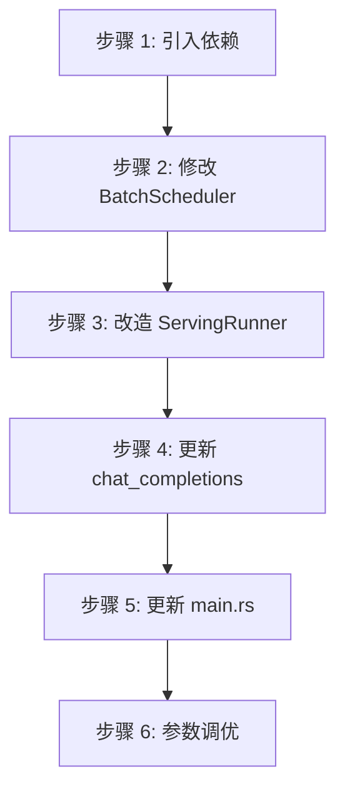

# 调度优化配置指南

---

## 目录

1. [可调参数](#1-可调参数)
2. [调优策略](#2-调优策略)
3. [迁移路径](#3-迁移路径)
4. [代码结构](#4-代码结构)

---

## 1. 可调参数

| 参数 | 默认值 | 建议范围 | 说明 |
|------|--------|----------|------|
| `chunk_size` | 256 | 64-1024 | 批处理 chunk 大小，作为 `token_threshold` 的传入值 |
| `schedule_timeout_ms` | 10 | 5-50 | 超时时间（毫秒） |
| `max_batch_size` | 8 | 4-32 | 最大批处理大小 |
| `runner_count` | CPU 核心数 | 1-CPU核心数 | Runner 任务数量 |
| `broadcast_capacity` | 64 | 32-256 | Broadcast channel 容量 |

---

## 2. 调优策略

| 场景 | 策略 |
|------|------|
| **低延迟** | 降低 `chunk_size`（传入更小的 `token_threshold`），提高响应性 |
| **高吞吐** | 提高 `chunk_size`（传入更大的 `token_threshold`），增加批处理效率 |
| **波动流量** | 设置较小的 `schedule_timeout_ms` |
| **计算密集** | `runner_count` 设为 CPU 核心数 |

---

## 3. 迁移路径

### 3.1 向后兼容

| 接口 | 兼容性 | 说明 |
|------|--------|------|
| `BatchScheduler::new()` | 完全兼容 | 保持原有接口 |
| `ServingRunner::start()` | 完全兼容 | 保持原有接口 |
| `chat_completions` | 完全兼容 | 内部逻辑升级 |

### 3.2 升级步骤



---

## 4. 代码结构

### 4.1 文件目录

```
src/
├── runtime/
│   ├── scheduling/
│   │   ├── scheduler.rs      # BatchScheduler + TokenCounter
│   │   └── state.rs          # SequenceState 定义
│   ├── runner.rs             # ServingRunner (Tokio 任务)
│   └── mod.rs                # Runtime 模块入口
├── serving/
│   ├── handlers.rs           # chat_completions Handler
│   ├── bootstrap.rs          # AppState 初始化
│   └── types.rs              # 请求/响应类型
└── main.rs                   # Tokio Runtime 启动
```

---

**文档版本**: v2.0
**最后更新**: 2026-06-01