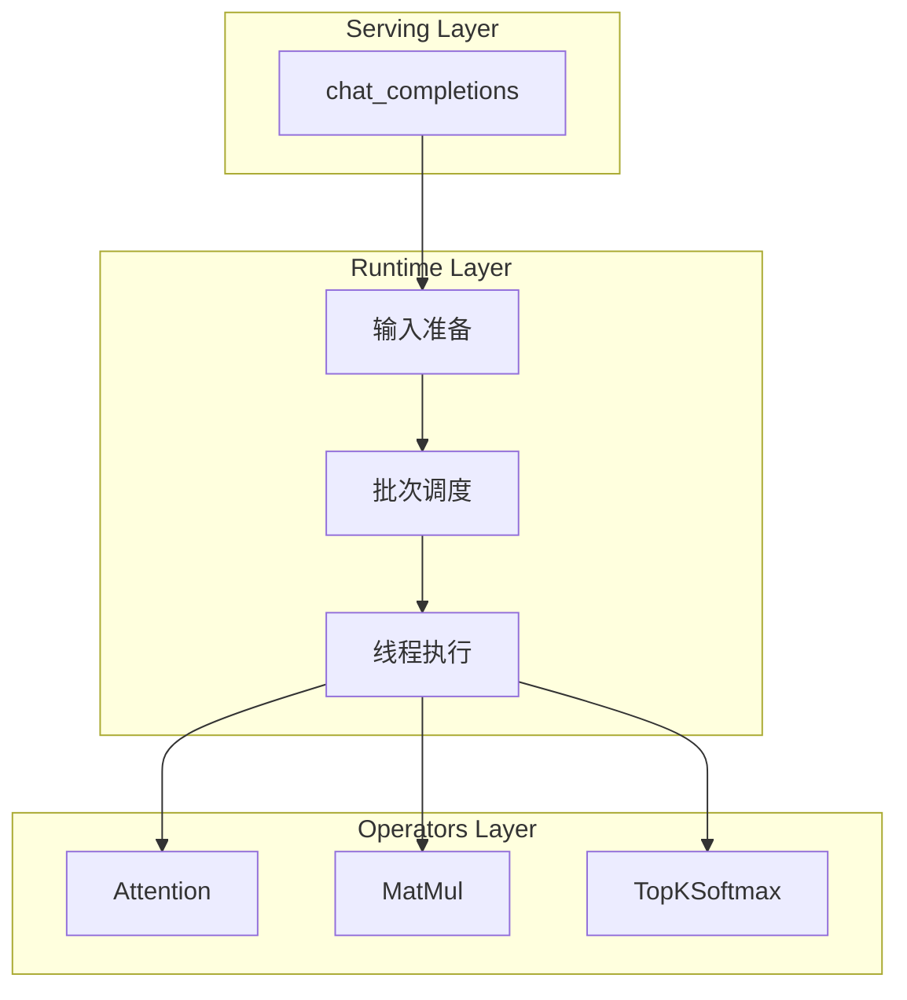
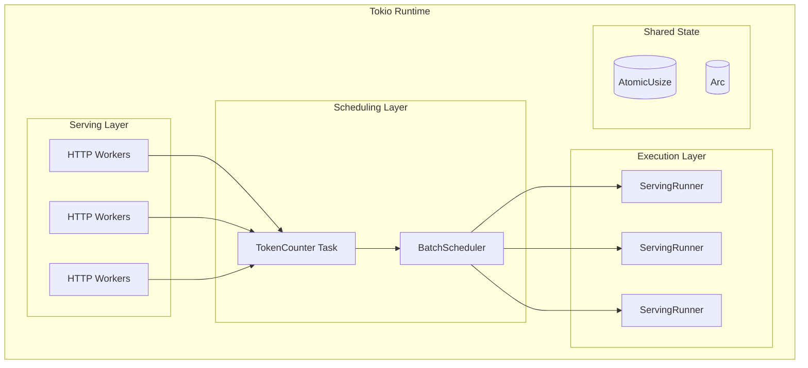
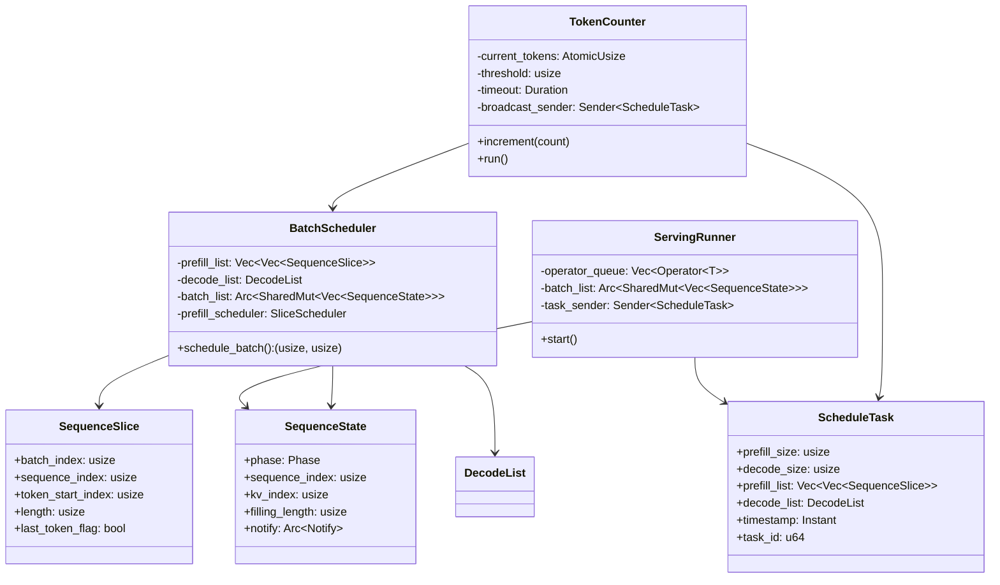
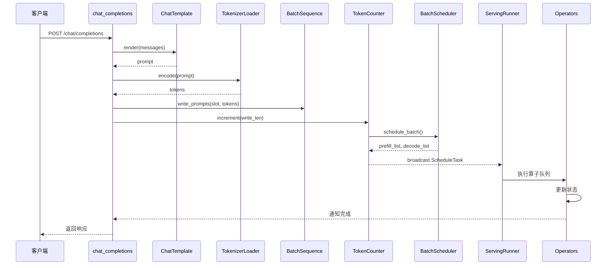
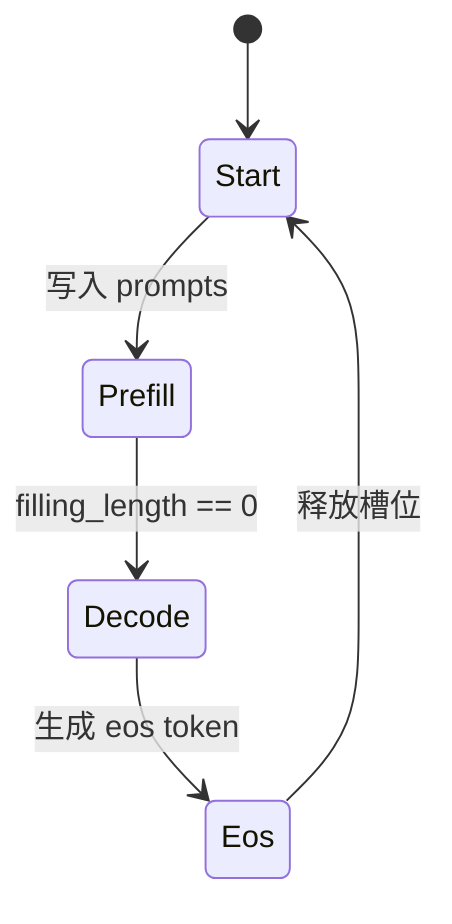

# Runtime 模块总览

---

## 目录

1. [模块定位](#1-模块定位)
2. [架构层次](#2-架构层次)
3. [线程管理](#3-线程管理)
4. [核心组件](#4-核心组件)
5. [数据流](#5-数据流)
6. [文件结构](#6-文件结构)

---

## 1. 模块定位

`src/runtime` 是 eLLM 推理执行层的核心运行时模块，负责将用户请求转换为可执行的计算任务，并协调多线程执行。

**核心职责**：
- **输入准备**：将聊天消息渲染为 prompt，编码为 token
- **批次调度**：按优先级规则生成本轮计算切片
- **线程执行**：管理线程池并行执行算子队列

---

## 2. 架构层次



| 层次 | 职责 | 关键组件 |
|------|------|----------|
| **输入准备** | Prompt 渲染与 Token 编码 | ChatTemplate, BatchSequence, TokenizerLoader |
| **批次调度** | 切片生成与任务分发 | BatchScheduler, TokenCounter |
| **线程执行** | 算子队列并行执行 | ServingRunner |

---

## 3. 线程管理

eLLM Runtime 的所有线程均由 **Tokio 异步运行时**统一管理，实现高效的并发执行和资源调度。

### 3.1 线程架构



### 3.2 线程划分

| 层级 | 线程类型 | 数量 | 职责说明 |
|------|----------|------|----------|
| **Serving** | HTTP Workers | 多个 | 并发处理客户端请求，接收 chat_completions 请求 |
| **Scheduling** | Tokio Task | 1 | `TokenCounter` 异步运行，管理调度触发逻辑 |
| **Execution** | Tokio Tasks | CPU 核心数 | `ServingRunner` 并行执行算子队列 |

### 3.3 Tokio 核心组件

| 组件 | 作用 | 使用场景 |
|------|------|----------|
| `tokio::time::interval` | 非阻塞定时器 | 超时触发调度 |
| `tokio::sync::broadcast` | 一对多任务推送 | 同步通知所有 Runner |
| `tokio::sync::Barrier` | 多任务同步 | Runner 并行执行协调 |
| `tokio::select!` | 异步事件多路复用 | 事件驱动调度 |

### 3.4 设计特点

- **异步优先**：所有组件基于 Tokio 异步模型，避免阻塞线程
- **事件驱动**：通过 token 阈值和时间窗口触发调度，而非轮询
- **无锁计数**：使用 `AtomicUsize` 实现无锁并发计数
- **动态扩展**：Runner 数量根据 CPU 核心数自动调整

---

## 4. 核心组件

### 4.1 组件关系



### 4.2 组件说明

| 组件 | 职责 | 文件位置 |
|------|------|----------|
| `BatchScheduler` | 生成本轮 prefill/decode 切片 | `scheduling/scheduler.rs` |
| `TokenCounter` | 统计 token 并触发调度 | `scheduling/token_counter.rs` |
| `ServingRunner` | 广播订阅式线程池执行器 | `runner.rs` |
| `SequenceState` | Batch 槽位状态 | `scheduling/state.rs` |
| `SequenceSlice` | 最小计算单元 | `scheduling/sequence_slice.rs` |
| `ScheduleTask` | 调度任务载体 | `scheduling/task.rs` |
| `BatchSequence` | Prompt 写入与结果解码 | `batch_sequence.rs` |
| `ChatTemplate` | 聊天模板渲染 | `chat_template.rs` |
| `TokenizerLoader` | Tokenizer 加载 | `tokenizer_loader.rs` |

---

## 5. 数据流

### 请求到执行流程



### 状态流转



---

## 6. 文件结构

```
src/runtime/
├── scheduling/
│   ├── scheduler.rs          # BatchScheduler 实现
│   ├── token_counter.rs      # TokenCounter 实现
│   ├── task.rs               # ScheduleTask 定义
│   ├── slice_scheduler.rs    # SliceScheduler 实现
│   ├── state.rs              # SequenceState, Phase 定义
│   └── sequence_slice.rs     # SequenceSlice, DecodeList 定义
├── batch_sequence.rs         # BatchSequence 实现
├── io/
│   ├── chat_template.rs      # ChatTemplate 实现
│   ├── tokenizer_loader.rs   # Tokenizer 加载
│   └── safetensors_loader.rs # 权重读取
├── runner.rs                 # ServingRunner 实现
└── mod.rs                    # 模块导出
```

---

**文档版本**: v2.0  
**最后更新**: 2026-06-01
