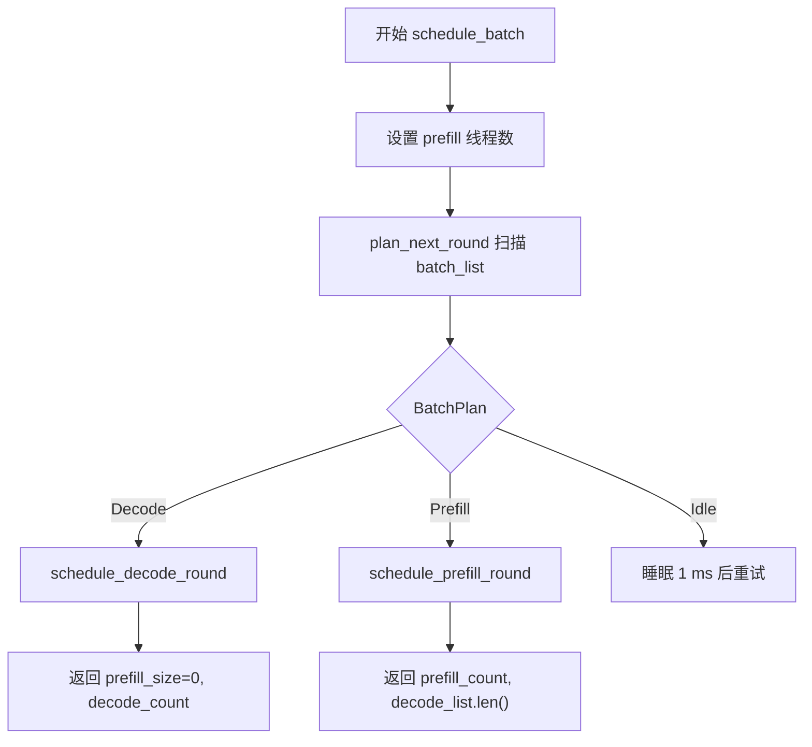
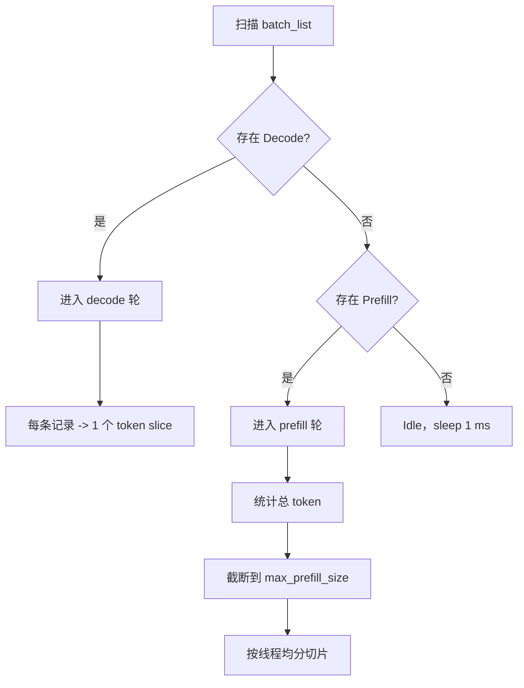

# 推理调度器说明

---

本文说明 `src/runtime/scheduler.rs` 和 `src/runtime/slice_scheduler.rs` 的实际行为。

先说结论：

* `BatchScheduler` 负责决定本轮是 `Decode`、`Prefill` 还是 `Idle`
* 它内部会先产出一个 `BatchPlan`，再把计划执行成切片
* 它只产出切片，不直接推进 `SequenceState`
* `Prefill` 轮会把 token 按静态配额拆到各线程
* `Decode` 轮则把每条序列压成一个长度为 1 的切片
* `decode_list` 是当前轮共用的 attention/decode 切片集合

---

## 1. 相关对象

### `SequenceState`

调度器扫描 `batch_list` 时主要看这几个字段：

| 字段 | 作用 |
| --- | --- |
| `phase` | 决定该槽位当前属于 decode 还是 prefill |
| `sequence_index` | prefill 起点 |
| `kv_index` | decode 时作为下一 token 的序列位置 |
| `filling_length` | prefill 还剩多少 token |

### `SequenceSlice`

调度器最终输出的最小工作单元。

| 字段 | 作用 |
| --- | --- |
| `batch_index` | 对应 batch 槽位 |
| `sequence_index` | 该 slice 在序列里的起点 |
| `token_start_index` | 本轮扁平 token 视图中的起点 |
| `length` | 连续 token 长度 |
| `last_token_flag` | 是否是 prompt 的最后一个 token；如果是，后续需要走 decode / 结果写回链路 |

### 输出列表

调度器每轮返回两类结果：

* `prefill_list: Vec<Vec<SequenceSlice>>`
* `decode_list: DecodeList`

其中：

* `prefill_list` 按线程分桶
* `decode_list` 是扁平的 attention/decode 切片列表

---

## 2. `BatchPlan`

`BatchPlan` 是 `BatchScheduler` 内部使用的“计划结果”。

它先表示下一轮该怎么跑，再由调度器真正生成切片：

* `Decode(Vec<(usize, usize)>)`
* `Prefill { candidates, total_tokens }`
* `Idle`

这样可以把“决策”和“切片生成”拆开：

* `plan_next_round()` 负责扫描 `batch_list` 并选出一个计划
* `schedule_batch()` 负责执行这个计划，填充 `prefill_list` / `decode_list`

优先级是：

* 只要存在 `Decode`，这一轮就是 `Decode`
* 否则如果存在 `Prefill`，这一轮就是 `Prefill`
* 否则调度器进入 `Idle`

---

## 3. 单轮调度入口



`schedule_batch()` 的流程可以概括为：

```text
1. 设置 prefill 线程数
2. 扫描 batch_list
3. 若存在 Decode -> 进入 decode 轮
4. 否则若存在 Prefill -> 进入 prefill 轮
5. 否则 sleep 1ms 并重试
```

这里的关键规则是：

* `Decode` 优先于 `Prefill`
* 一轮只执行一种模式
* 即使是 `Prefill` 轮，也会产出 `decode_list`，因为最后一个 token 之后仍然要走 attention/decode 这条路径

---

## 4. Decode 轮

### 候选收集

调度器会从 `batch_list` 中筛出所有 `Phase::Decode` 项。

最多只会取前 `max_decode_size` 个候选，其中：

```text
max_decode_size = batch_size
```

### 切片生成

每个 decode 候选都会生成一个长度为 `1` 的 `SequenceSlice`：

* `sequence_index` 直接取 `record.kv_index`
* `last_token_flag = true`
* `token_start_index` 按出现顺序递增

因此 decode 轮的结果非常简单：

* 一条序列本轮只贡献 1 个 token
* `decode_list` 是这一轮的 attention/decode 切片集合
* `prefill_list` 会被清空

---

## 5. Prefill 轮

### 候选收集

对每个 `Phase::Prefill` 的记录，调度器会读取：

* `batch_index`
* `sequence_index`
* `filling_length`

然后把 `filling_length` 累加成本轮潜在总 token 数。

### 单轮上限

prefill 的总 token 数不会无限增长，而是会被窗口限制：

```text
max_prefill_size = sequence_length * batch_size
total_tokens = min(sum(filling_length), max_prefill_size)
```

这表示：

* 如果总需求不超过窗口，本轮尽量全部调度
* 如果总需求超过窗口，只调度窗口允许的部分

### 切片生成

prefill 轮会同时生成两种视图：

* `decode_list` 中的扁平连续区间
* `prefill_list` 中按线程分配的切片

`SliceScheduler::schedule_for_sequence()` 会把一条序列按当前任务配额拆成多个 slice，并把它们推入对应线程的 `prefill_list`。

### 线程配额

`FairTaskAllocator` 的均分规则是：

```text
base_quota  = total_tokens / task_count
extra_quota = total_tokens % task_count
```

因此：

* 前 `extra_quota` 个线程拿 `base_quota + 1`
* 其余线程拿 `base_quota`

如果 token 数少于线程数，只有少数线程会被激活。

---

## 6. `decode_list` 的实际含义

`decode_list` 不是“只给 decode 用”的列表。

它在两种模式下都承载扁平的 attention/decode token 视图：

* decode 轮：每条 slice 长度固定为 1
* prefill 轮：slice 表示一段连续 attention 区间

这也是后续 `Attention`、`LiftVector`、`TopKSoftmax` 等算子统一消费它的原因。

---

## 7. 状态更新边界

`BatchScheduler` 本身不修改 `SequenceState`。

从当前代码看，状态推进发生在算子阶段，尤其是 `TopKSoftmax`：

* 如果一个 slice 来自 `Prefill`，会先推进 `sequence_index`、`kv_index`、`filling_length`
* 当 `filling_length == 0` 时，阶段切到 `Decode`
* `last_token_flag` 只标记“这是不是 prompt 的最后一个 token”
* 当 slice 是最后一个 token，且记录已经处于 `Decode` 时，才会真正写回输出 token
* 如果输出 token 命中 `eos_id`，阶段会切到 `Eos` 并通知上层

所以，调度器和状态机是分开的：

* 调度器只决定“本轮该跑什么”
* 算子决定“跑完之后状态怎么变”

---

## 8. 典型执行路径



```text
batch_list 扫描
    if any Decode:
        进入 decode 轮
        每条记录 -> 1 个 token slice
    else if any Prefill:
        进入 prefill 轮
        统计总 token
        截断到窗口上限
        按线程均分切片
    else:
        Idle，sleep 1ms
```

---

## 9. 代码入口参考

* `src/runtime/scheduler.rs`
* `src/runtime/slice_scheduler.rs`
* `src/operators/softmax/topk_softmax.rs`
* `src/runtime/runner.rs`

