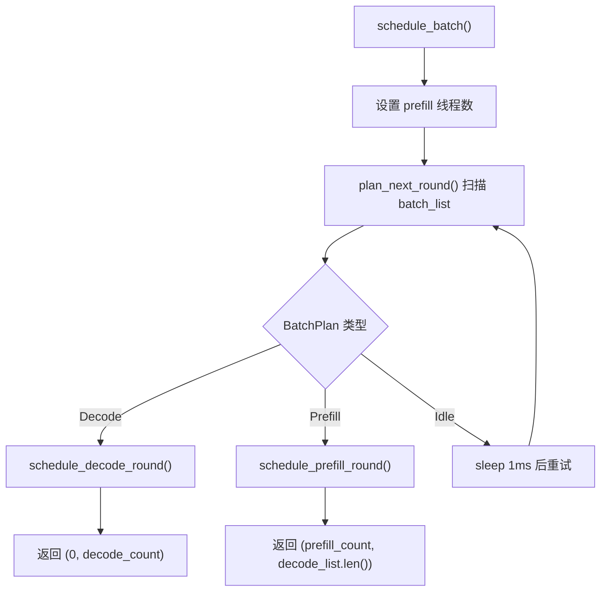
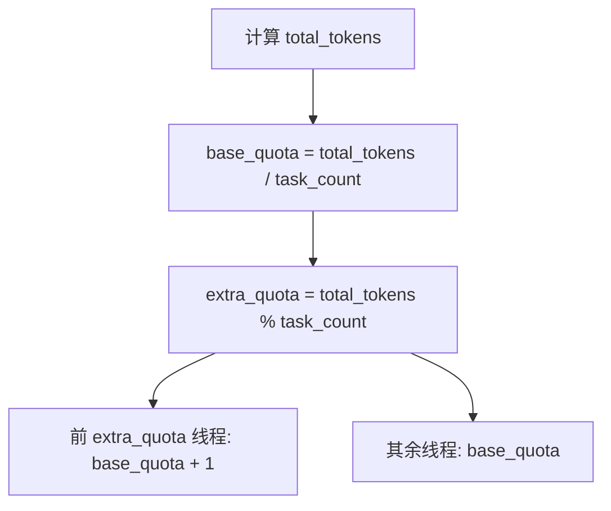
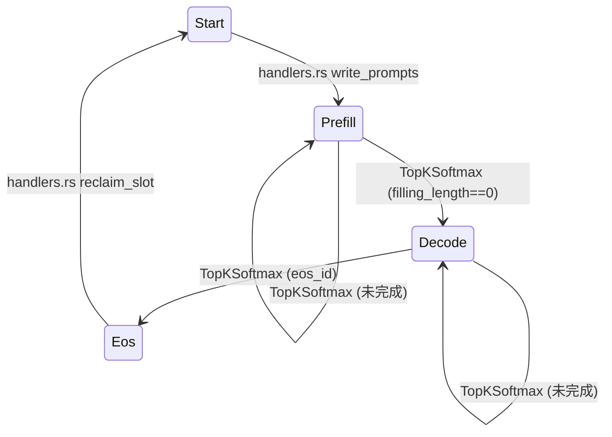
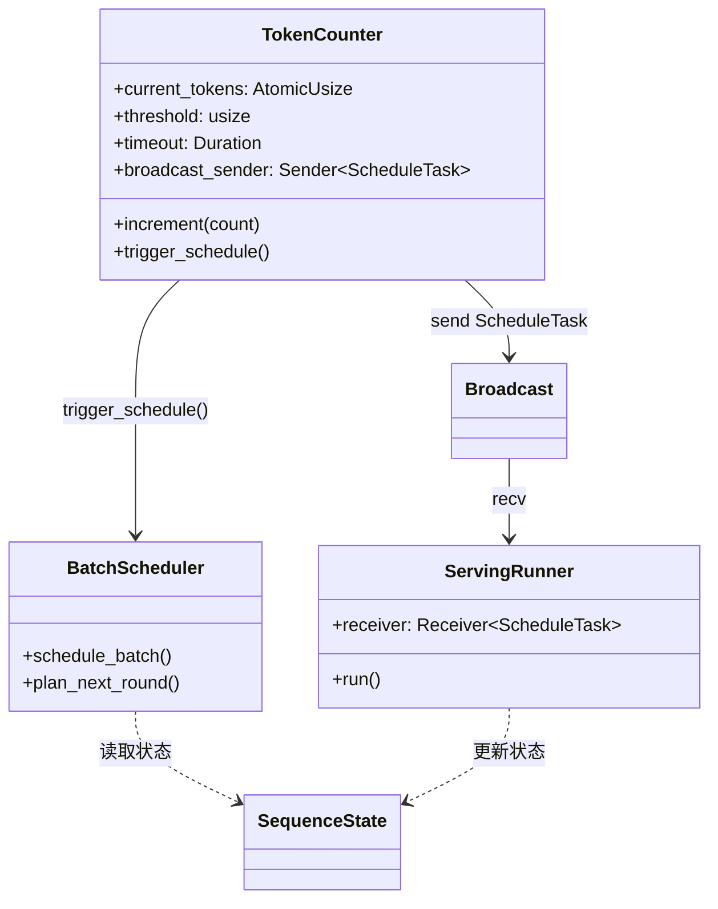
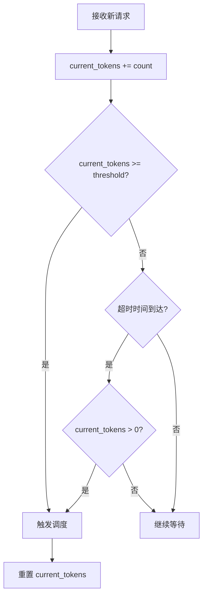
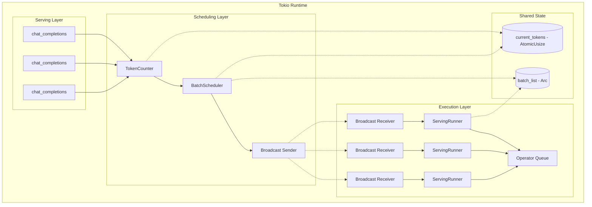
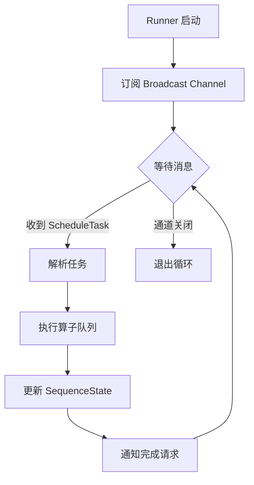
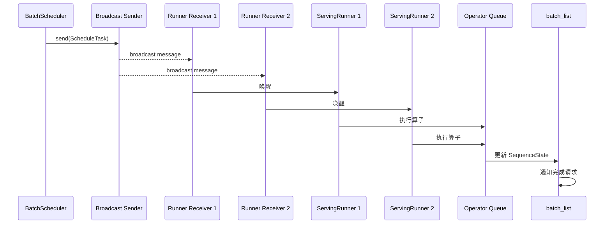
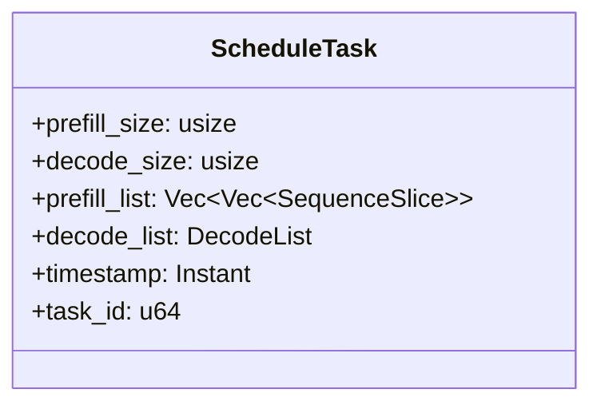

# 调度器设计详解

---

## 目录

**基础调度**

1. [调度器概述](#1-调度器概述)
2. [核心数据结构](#2-核心数据结构)
3. [调度流程](#3-调度流程)
4. [Decode 轮调度](#4-decode-轮调度)
5. [Prefill 轮调度](#5-prefill-轮调度)
6. [状态更新边界](#6-状态更新边界)

**优化调度**

7. [事件驱动触发](#7-事件驱动触发)
8. [双触发机制](#8-双触发机制)
9. [Tokio 异步架构](#9-tokio-异步架构)
10. [Broadcast 任务推送](#10-broadcast-任务推送)

---

## 1. 调度器概述

`BatchScheduler` 是 eLLM 推理引擎的核心调度组件，负责决定每轮计算的执行模式和切片分配。

**核心职责**：
- 扫描 `batch_list` 中的所有序列状态
- 决定本轮执行 `Decode`、`Prefill` 或 `Idle`
- 生成对应的 `SequenceSlice` 列表供算子执行

**调度优先级**：
1. **Decode 优先**：只要存在 `Phase::Decode` 的序列，本轮执行 Decode 轮
2. **Prefill 次之**：若无 Decode，执行 Prefill 轮
3. **Idle 兜底**：若无待处理序列，进入空闲状态

---

## 2. 核心数据结构

### 2.1 调度相关状态

| 数据结构 | 作用 | 关键字段 |
|----------|------|----------|
| `SequenceState` | 描述单个 batch 槽位状态 | `phase`, `sequence_index`, `kv_index`, `filling_length` |
| `SequenceSlice` | 最小计算单元 | `batch_index`, `sequence_index`, `token_start_index`, `length`, `last_token_flag` |
| `DecodeList` | Decode/Attention 切片容器 | 提供 `push`, `clear`, `total_token_count` |
| `BatchPlan` | 调度计划枚举 | `Decode`, `Prefill`, `Idle` |

### 2.2 SequenceState 字段说明

| 字段 | 类型 | 作用 |
|------|------|------|
| `phase` | `Phase` | 当前阶段：`Start`/`Prefill`/`Decode`/`Eos`/`Timeout` |
| `sequence_index` | `usize` | 当前序列游标，prefill 起点 |
| `kv_index` | `usize` | KV 缓存位置，下一次写入位置 |
| `filling_length` | `usize` | 剩余待处理的 prefill token 数 |
| `notify` | `Arc<Notify>` | 完成通知同步原语 |

### 2.3 SequenceSlice 字段说明

| 字段 | 类型 | 作用 |
|------|------|------|
| `batch_index` | `usize` | 所属 batch 槽位索引 |
| `sequence_index` | `usize` | 在序列中的起始位置 |
| `token_start_index` | `usize` | 本轮扁平 token 视图中的起点 |
| `length` | `usize` | 连续 token 长度 |
| `last_token_flag` | `bool` | 是否为 prompt 最后一个 token |

---

## 3. 调度流程

### 3.1 调度入口



### 3.2 计划生成逻辑

```text
plan_next_round() 流程：
1. 遍历 batch_list 收集候选
2. 存在 Decode -> 返回 BatchPlan::Decode
3. 存在 Prefill -> 返回 BatchPlan::Prefill
4. 否则返回 BatchPlan::Idle
```

---

## 4. Decode 轮调度

### 4.1 Decode 轮特点

| 特性 | 说明 |
|------|------|
| **候选选择** | 所有 `Phase::Decode` 的序列 |
| **数量限制** | 最多 `max_decode_size` 个（等于 `batch_size`） |
| **切片长度** | 固定为 1 |
| **prefill_list** | 清空 |

### 4.2 切片生成

```text
for (batch_index, sequence_index) in decode_candidates:
    DecodeList.push(SequenceSlice {
        batch_index,
        sequence_index,
        token_start_index: decode_count,
        length: 1,
        last_token_flag: true,
    })
    decode_count += 1
```

---

## 5. Prefill 轮调度

### 5.1 Prefill 轮特点

| 特性 | 说明 |
|------|------|
| **候选选择** | 所有 `Phase::Prefill` 的序列 |
| **数量限制** | 总 token 数不超过 `max_prefill_size` |
| **切片长度** | 可变，取决于配额 |
| **输出** | 同时生成 `prefill_list` 和 `decode_list` |

### 5.2 总 token 计算

```text
max_prefill_size = sequence_length * batch_size
total_tokens = min(sum(filling_length), max_prefill_size)
```

### 5.3 线程配额分配



### 5.4 切片分配示例

假设 `total_tokens=23`, `task_count=3`:

| 线程 | 配额 | 实际分配 |
|------|------|----------|
| Thread 0 | 8 | tokens 0-7 |
| Thread 1 | 8 | tokens 8-15 |
| Thread 2 | 7 | tokens 16-22 |

---

## 6. 状态更新边界

### 6.1 调度器不负责状态更新

`BatchScheduler` 只生成切片，不修改 `SequenceState`。状态更新发生在：

| 阶段 | 位置 | 更新内容 |
|------|------|----------|
| **写入 Prompt** | `handlers.rs` | 设置 `phase=Prefill`, `filling_length` |
| **Prefill 执行** | `TopKSoftmax` | 推进 `sequence_index`, `kv_index`, `filling_length` |
| **切换到 Decode** | `TopKSoftmax` | `filling_length==0` 时设置 `phase=Decode` |
| **生成完成** | `TopKSoftmax` | 遇到 `eos_id` 时设置 `phase=Eos` |

### 6.2 状态流转图



---

## 7. 事件驱动触发

### 7.1 原有轮询模式的问题

| 问题 | 影响 | 严重程度 |
|------|------|----------|
| 轮询模式（每 1ms 唤醒一次） | CPU 资源浪费、延迟不确定 | 高 |
| 无法聚合请求 | 批处理效率低 | 中 |
| 阻塞等待 | 响应性差 | 中 |

### 7.2 事件驱动设计原则

| 原则 | 说明 |
|------|------|
| **异步优先** | 使用 Tokio 异步管理，避免阻塞线程 |
| **事件驱动** | 通过 token 阈值和时间窗口触发调度，而非轮询 |
| **一对多推送** | 使用 Broadcast 实现任务到多个 Runner 的同步推送 |
| **无锁计数** | 使用原子操作实现无锁并发计数 |

### 7.3 优化后的组件关系



---

## 8. 双触发机制

### 8.1 触发方式

结合阈值触发和时间窗口，避免单一触发的局限性。

| 触发方式 | 触发条件 | 适用场景 |
|----------|----------|----------|
| **阈值触发** | `current_tokens >= token_threshold` | 高流量时及时调度 |
| **超时触发** | 时间窗口到期且 `current_tokens > 0` | 低流量时保证延迟 |

### 8.2 触发决策流程



### 8.3 TokenCounter 设计

**字段设计**：

| 字段 | 类型 | 作用 |
|------|------|------|
| `current_tokens` | `AtomicUsize` | 原子计数，无锁并发写入 |
| `threshold` | `usize` | 调度触发阈值（值为 chunk_size） |
| `timeout` | `Duration` | 超时时间窗口 |
| `last_schedule_time` | `tokio::time::Instant` | 上次调度时间 |
| `broadcast_sender` | `Sender<ScheduleTask>` | Broadcast 发送端 |

**API 设计**：

| 方法 | 功能 | 参数 | 返回值 |
|------|------|------|--------|
| `new(threshold, timeout, sender)` | 构造函数 | threshold=chunk_size、超时、sender | `TokenCounter` |
| `increment(count)` | 增加计数 | token 数量 | `bool` (是否触发调度) |
| `reset()` | 重置计数 | 无 | `()` |
| `get()` | 获取当前值 | 无 | `usize` |
| `trigger_schedule()` | 触发调度 | 无 | `()` |

### 8.4 Tokio 超时窗口实现

```rust
impl TokenCounter {
    pub async fn run(&self) {
        let mut interval = tokio::time::interval(self.timeout);
        loop {
            tokio::select! {
                _ = interval.tick() => {
                    if self.current_tokens.load(Ordering::Relaxed) > 0 {
                        self.trigger_schedule().await;
                    }
                }
            }
        }
    }
}
```

**关键点**：

| 要点 | 说明 |
|------|------|
| `tokio::time::interval` | 创建 Tokio 定时器，非阻塞异步等待 |
| `interval.tick()` | 每次超时触发 |
| `current_tokens > 0` | 确保有时间窗口内有待处理请求才调度 |
| `trigger_schedule()` | 触发调度并重置计数器 |

---

## 9. Tokio 异步架构

### 9.1 整体架构



### 9.2 线程划分

| 层级 | 线程类型 | 数量 | 说明 |
|------|----------|------|------|
| Serving | HTTP Workers | 多个 | 并发处理请求 |
| Scheduling | Tokio Task | 1 | TokenCounter 异步运行 |
| Execution | Tokio Tasks | CPU 核心数 | Runner 并行执行 |

### 9.3 ServingRunner 执行流程



---

## 10. Broadcast 任务推送

### 10.1 数据流



### 10.2 ScheduleTask 结构



### 10.3 并发安全机制

| 资源 | 保护机制 | 说明 |
|------|----------|------|
| `current_tokens` | `AtomicUsize` | 无锁原子操作 |
| `batch_list` | `Arc<SharedMut>` | 共享可变状态 |
| Slot 分配 | `Semaphore + Mutex<VecDeque>` | 防止重复分配 |
| 任务广播 | `tokio::sync::broadcast` | 一对多可靠推送 |
| Runner 同步 | `tokio::sync::Barrier` | 多任务同步执行 |

---

**文档版本**: v3.0
**最后更新**: 2026-06-01